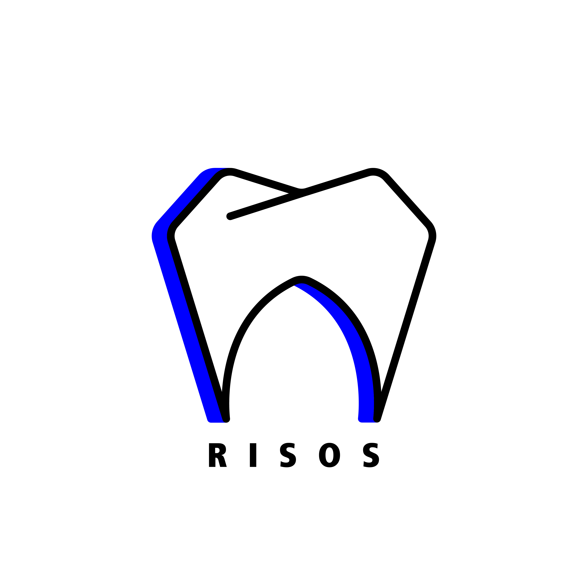

# Risos

Risos is a Dental Project aimed at automating the Smile Design procedure. The first version focuses on teeth orientation, leveraging OpenCV to remove original teeth images.


## Features

- **Automated Smile Design**: Streamlines the process of smile design using OpenCV.
- **GraphQL Integration**: Easily configurable GraphQL setup for backend communication.

## Getting Started

### Prerequisites

Ensure you have the following installed:

- [Node.js](https://nodejs.org/) (version >= 0.8.4)
- npm (comes with Node.js)

### Installation

1. Clone the repository:
   ```bash
   git clone https://github.com/amirda9/Risos.git
   cd Risos
   npm install
   ```

2. Configure the GraphQL endpoint:
   - Modify `codegen.yml` and `Graphql.module.ts` to point to your backend GraphQL server.

### Running the Application

Start the application using:
```bash
npm start
```

## About

Risos Dental Project is designed to simplify and automate the Smile Design process.



## Contributing

1. Fork the repository.
2. Create a new branch (`git checkout -b feature-branch`).
3. Make your changes and commit them (`git commit -m 'Add some feature'`).
4. Push to the branch (`git push origin feature-branch`).
5. Open a Pull Request.

## License

This project is licensed under the MIT License - see the [LICENSE](LICENSE) file for details.
